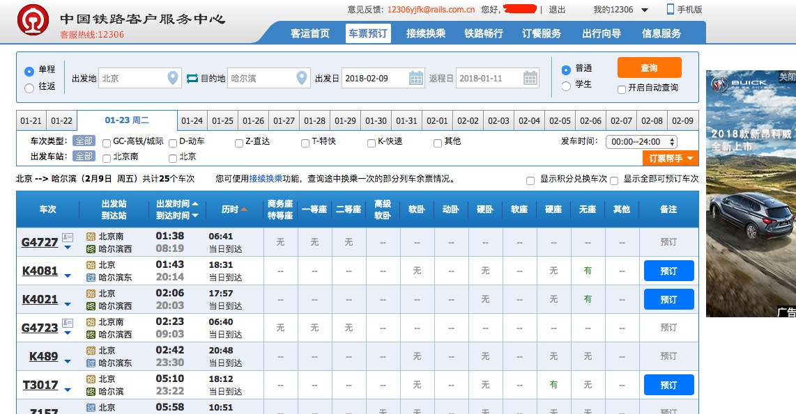
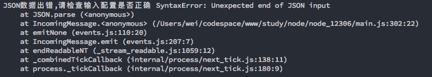

# node_12306  刷票代码
## 1、感谢
首先感谢原作者[@lhlybly](https://github.com/lhlybly) （原项目地址：https://github.com/lhlybly/node_12306)，本项目是借鉴了原作者的代码。

主要区别是，原作者是通过邮箱发送信息，从而完成一系列操作。而我是直接使用了本地的提示，并结合了前端的一些脚本控制，能直接完成到订单提交页面中去。

同时增加了几个常用席位的选择的功能。

## 2、使用方法：
  * 首先登录你的12306到查询结果列表页面
    
    并在控制台输中入如下代码一：
    ```
    // 脚本代码一
    setInterval(function(){
      $("#query_ticket").click();
      $("#queryLeftTable")[0].childNodes.forEach(function(item,index){
        var id = item.id;
        if(id.indexOf('ticket') >= 0){
          if(id.indexOf('Z17') >= 0){
            console.log($(item)[0].lastElementChild);
            $(item)[0].lastElementChild.childNodes[0].click()
          }
        }
      })
    },20000)
    ``` 
    同时 ```   if(id.indexOf('Z17') >= 0)      ``` 中的Z17换成你自己的目标车次。
    这一块可能不太严谨-（比如出现了：Z17 Z1796 这样的情况，但是我自己用的时候并没有什么问题，如果碰到的话，就自行修改或者联系我修改也行，再不然的话直接用代码二也行）

    ```
    // 脚本代码二
    setInterval(function(){
      $("#query_ticket").click();
    },20000)
    ```
    因为12306页面在一点时间不操作的话，就会自动登出，所以哪怕到时候刷到票了，你也要重新登录一下（就可能没票了），所以在页面中写一个这个脚本执行代码，每20秒就请求一下接口，目的就是不让你自己的账号登出。

    接下来开启程序， **但是 不要关闭页面** （当然如果你对自己的手速足够自信的话，也不用。。。）

  ## 3、运行程序方法：
  * 克隆代码到本地``` git clone https://github.com/xsw911213/12306.git ``` 
  * 在当前文件夹终端``` npm install ```安装依赖
  * ```node main.js```，第一次运行会要求输入信息并且存入config.json，以后再次运行只会读取config.json中的数据，不会要求再次输入。
  * ```node main.js -r```可以重写config.json(重新输入信息)。
  * 车次(```train_num```字段)可以输入多个车次，用|分开，如K123|K234(前提这些车次都在同一线路上)。
  * 席位(```focus```字段)跟车次差不多，目前支持能自主选择的有 商务座 一等座 二等座 软卧 硬座 软座 硬卧 中间需要用  “|”
  * 接下来，你就只能等着了
  * 对了，程序运行过程中可能偶尔会出现这个情况
  
  不用管它，让它跑着就行了

  ## 4、适用人群：
  * 有点前端基础（懂点JQ就行），就算你没有，你周围总有朋友有吧。如果实在没有的话，那你就走吧，这个东西不适合你。。。
  * 经常能在电脑面前

  ## 5、声明
  * 这个程序并不能完成自动下单到付款页面（目前确实没有太多的时间研究）
  * 如果实在是刷不到，就去花钱买一个别人的服务（什么飞猪、携程等等），也没有那么贵，人家的水平比我高
  * 如果有一些好的想法可以交流，但是别喷，有话好好说。。。免费的东西，差不多就行了。。。别做一个伸手党还挺理直气壮的
  * 如果想使用邮箱通知功能的，请用原作者的程序 https://github.com/lhlybly/node_12306
  * 如果觉得这个东西不好的话，请点击左上角或者右上角的关闭，谢谢
  * 最后再次真诚感谢原作者，甚至readme文件也抄了不少，不是说人家的不好，而是并不适合我自己使用而已，基于人家的劳动成果改成了最适合我自己的
  * 如果觉得不适合你自己使用的话，可以自行修改
  * 同时代码是在mac上运行的，win上在写这篇readme的时候还没试过
